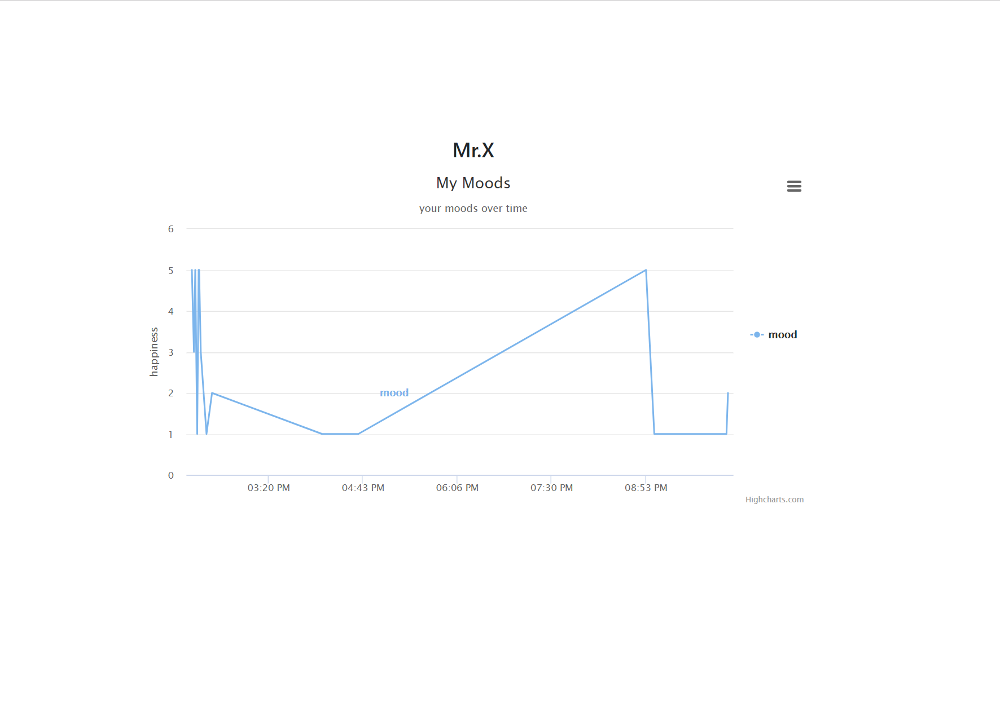

# Q1EmotionTracker

This emotion tracker not only tracks a user's mood, but also enhances it.

Technology used:
+ HTML, CSS, JavaScript
+ Highcharts, Moment.JS, Bootstrap

This project also uses local storage and client side validation.

You can select any character that best describes your emotions.

The progress page shows your mood trends over time.

This site is deployed through surge.
https://emo-tracker.surge.sh/
