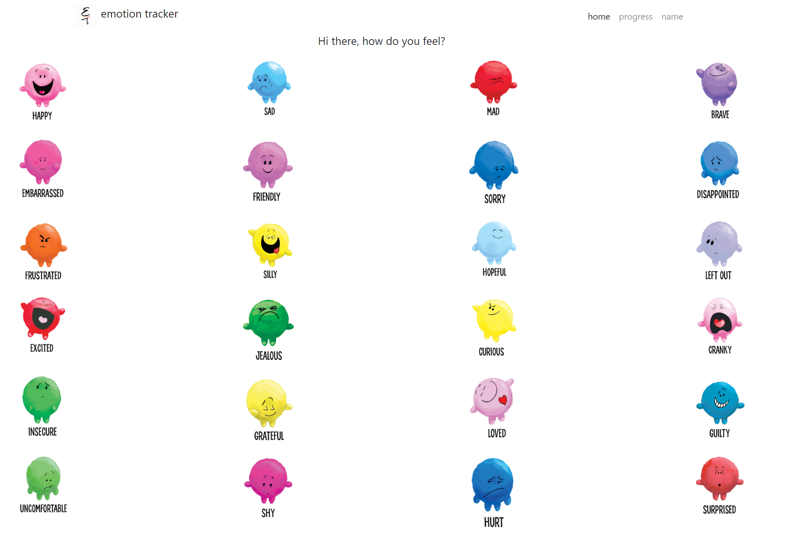
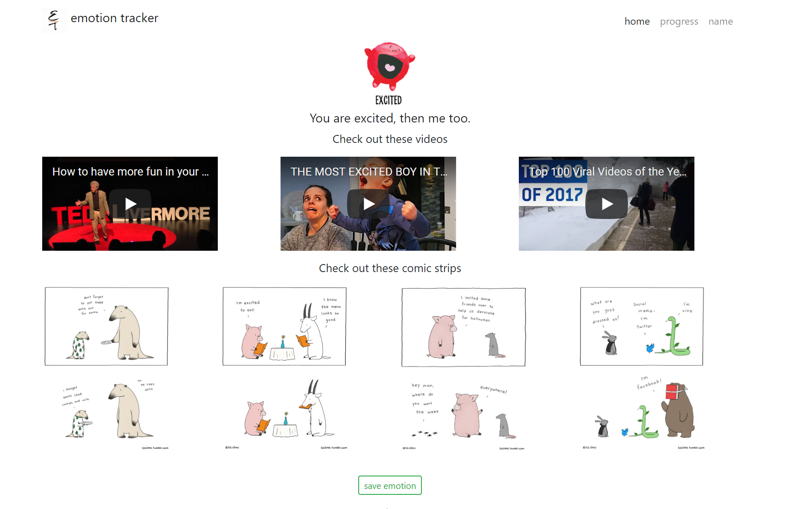

# Q1EmotionTracker

This emotion tracker not only tracks a user's mood, but also enhances it. 

Technology used: 
+ HTML, CSS, JavaScript
+ Highcharts, Moment.JS, Bootstrap

This project also uses local storage and client side validation. 

